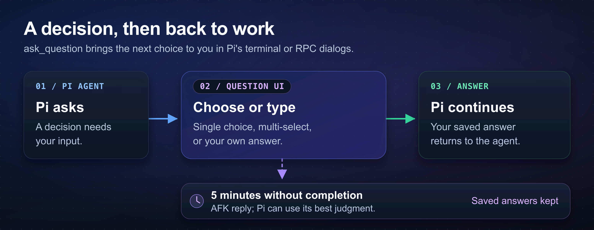

# pi-ask-question

Give [Pi](https://github.com/earendil-works/pi) a way to ask you a question, offer choices, and wait for your answer before continuing. Use it when you want a say in the next step, or turn on `/grill-me` to have the agent work through unclear requirements with you.



*Pi brings the decision to you; your answer goes back to the agent, with an AFK reply after five minutes if you have not finished.*

## Install and try it

Requires **Pi 1.0.0+** and **Node.js 24+**. Supports official Pi releases and the maintained fork.

```bash
pi install npm:@fitchmultz/pi-ask-question
pi
```

Already running Pi? Use `/reload` to load the extension. Then try a request like:

> Help me plan a settings page. Use ask_question to ask which settings to include before you start.

[Git installation and update notes](docs/reference.md#installation-and-updates) are also available.

## Answering questions

The agent can ask one question or several in a row. Pick an offered choice, select several when allowed, or choose **Type a custom answer** to write your own.

In Pi's terminal UI:

- **Up/Down** move through choices; **Enter** selects a single answer.
- **Space** toggles multi-select choices; **Enter** moves on once you have a selection.
- For question sets and multi-select, **Left/Right or Tab** move between questions and the final review. Check **Review answers**, then press **Enter** to submit.
- **PageUp/PageDown** read long questions, choices, or reviews. Use **Shift+PageUp/Shift+PageDown** in fullscreen mode.
- **Escape** cancels, or leaves a custom-answer edit and returns to the choices.

These are the default controls; the UI shows your configured bindings. Your editor draft stays intact while the question covers the current screen.

RPC clients use Pi's selection and input dialogs. The tool needs a terminal UI or an RPC client that handles those dialogs; print and JSON modes return an error.

Each call has **one five-minute limit**, shared across every question. At timeout, the agent receives an AFK reply and can continue using its best judgment. Saved answers are kept; unfinished typing is not submitted, and the tool does not choose an option for you.

## Work through a request with `/grill-me`

Turn it on before giving Pi a request you want to think through:

```text
/grill-me on
```

The agent is guided to inspect the available evidence, resolve the important decisions first, and ask one blocking question at a time with its suggested answer first. Clear, low-risk steps can still proceed without a question.

Use `/grill-me` to toggle, `/grill-me off` to stop, or `/grill-me status` to check. The terminal footer shows `grill-mode` while enabled. The setting belongs to your current session branch and survives `/reload`. In print and JSON modes, grill-me asks in normal text.

## Go deeper

- [Tool reference](docs/reference.md#tool-shape) — single and multi-question examples, result fields, and timeout details.
- [Cooperative TUI answers](docs/reference.md#cooperative-tui-answers) — the shared event-bus protocol for trusted extensions.
- [Development](docs/development.md) — local loading, tests, host compatibility, and publishing policy.
- [Changelog](CHANGELOG.md) · [Report an issue](https://github.com/fitchmultz/pi-ask-question/issues)

## License

[MIT](LICENSE) — Mitch Fultz.
